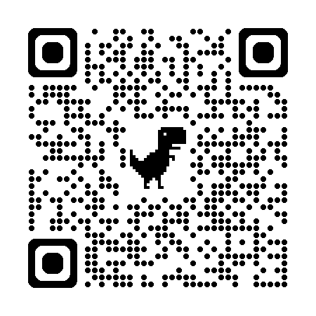

# Intro to TDD (Python + pytest) — FizzBuzz (Codespaces-ready)

Hi, this repo is quick way to start with a basic python environment fully configured for codespaces.

You can click on the following URL to create your own codespaces environment:

[Click here to launch your personal codespaces environment - you will need a github account](https://codespaces.new/fahadisheikh//intro-to-tdd-python-codespaces?quickstart=1)


This will do the following:

1. Create a new codespaces (VSCode in a browser) environment (you will need to sign in with a github or other accounts)
2. Clone this repo https://github.com/fahadisheikh/intro-to-tdd-python-codespaces into this new environment
2. Setup the vscode with python extensions and also create a virtualenv using venv
3. Setup the python paths and pytest to be able to run tests

## Test Everything is Working

Once VSCode environment is ready run the following in Terminal window:

```bash
pytest
```

You should see something like:

```bash
no tests ran in 0.01s
```

Great! You are now ready to begin the FizzBuzz TDD Workshop!

[Go to the Tutorial](TUTORIAL.md) to get started.


## QR Code for the repo:
Scan QR Code to get here to the repo:

